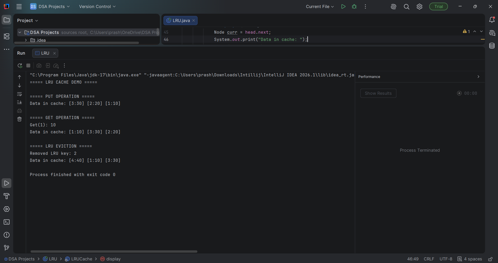

# 🔥 LRU Cache Implementation in Java

This project is a simple implementation of an **LRU (Least Recently Used) Cache** using Java.

While learning DSA, I wanted to understand how caching actually works in real systems, so I built this using a combination of a **HashMap** and a **Doubly Linked List**.

---

## 💡 What is LRU Cache?

An LRU Cache removes the **least recently used item** when the cache reaches its capacity.

So whenever:

* You **access (get)** a key → it becomes recently used
* You **insert (put)** a new key and cache is full → the least used item is removed

---

## ⚙️ How I implemented it

I used two data structures:

* **HashMap** → for quick access to nodes (O(1))
* **Doubly Linked List** → to maintain order of usage

The most recently used element stays at the **front**, and the least recently used stays at the **end**.

---

## 🚀 Operations

* `get(key)`

  * Returns the value if present
  * Moves the key to the front (recently used)

* `put(key, value)`

  * Inserts or updates a value
  * If capacity is exceeded → removes least recently used key

---

## ⏱️ Time Complexity

* `get()` → O(1)
* `put()` → O(1)

---

## 🖥️ Sample Output

---

## 🎯 Why I built this

I built this project to:

* Strengthen my understanding of **HashMap + Linked List combination**
* Learn how **real-world caching systems** work
* Practice writing **clean and structured code**

---

## 🙌 Final Thoughts

This was a great exercise to understand how multiple data structures can be combined to solve problems efficiently.

Feel free to explore or improve the implementation!

⭐ If you found this useful, consider giving it a star!
